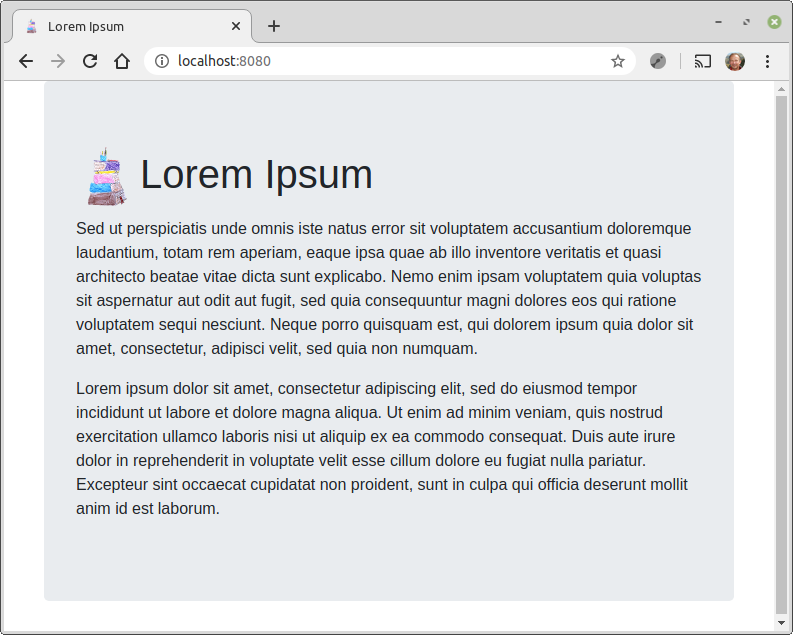

#  Lorem ipsum web [![][LoremIpsumServerAkkaMvnImg]][LoremIpsumServerAkkaMvnLnk]

A [lorem ipsum][wiki-lorem] web application server based on [akka http][akka-http] framework, and
a dedicated [lorem ipsum library][lorem-lib]. 
It is both a runnable application and a library whose routes can be embedded in other web applications.

It has been deployed on https://mapland.fr/lorem



## Quick local start

Thanks to [coursier][cs] from @alxarchambault,
this application is quite easy to start, just execute :
```
cs launch fr.janalyse::lorem-ipsum-server-akkahttp:1.0.8
```

## Configuration
| Environment variable           | Description                                    | default value
| ------------------------------ | ---------------------------------------------- | -----------------
| LOREM_IPSUM_LISTEN_IP          | Listening network interface                    | "0.0.0.0"
| LOREM_IPSUM_LISTEN_PORT        | Listening port                                 | 8080
| LOREM_IPSUM_PREFIX             | Add a prefix to all defined routes             | ""
| LOREM_IPSUM_URL                | How this service is known from outside         | "http://127.0.0.1:8080"
| LOREM_IPSUM_TITLE              | Home page title of this application            | "Lorem Ipsum"
| LOREM_IPSUM_START_WITH_LOREM   | Always start with "Lorem ipsum" ?              | true
| LOREM_IPSUM_WORD_COUNT_MIN     | Minimum amount of generated words              | 142
| LOREM_IPSUM_WORD_COUNT_MAX     | Maximum amount of generated words              | 442
| LOREM_IPSUM_BACKGROUND_COLOR   | Home page background color                     | "#F0F0F0"
| LOREM_IPSUM_FOREGROUND_COLOR   | Home page foreground color                     | "#505050"


[cs]: https://get-coursier.io/
[deployed]:   http://crosson.fr/lorem
[lorem-lib]:  https://github.com/dacr/lorem-ipsum
[wiki-lorem]: https://en.wikipedia.org/wiki/Lorem_ipsum
[akka-http]:  https://doc.akka.io/docs/akka-http/current/index.html

[LoremIpsumServerAkka]:       https://github.com/dacr/lorem-ipsum-server-akkahttp
[LoremIpsumServerAkkaMvnImg]: https://img.shields.io/maven-central/v/fr.janalyse/lorem-ipsum-server-akkahttp_2.13.svg
[LoremIpsumServerAkkaMvnLnk]: https://search.maven.org/#search%7Cga%7C1%7Cfr.janalyse.lorem-ipsum-server-akkahttp
